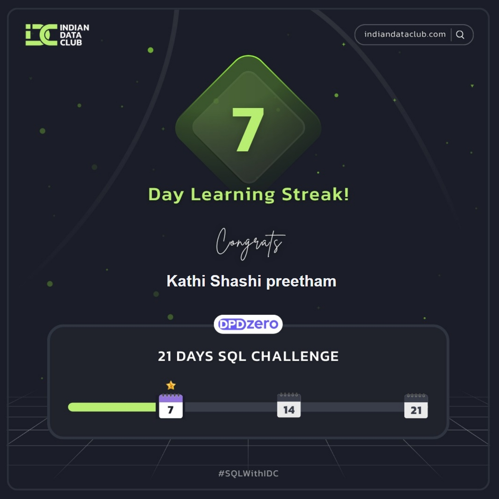

# 21 Days SQL Challenge 🚀

## What’s This?
Conquering the 21 Days SQL Challenge, hosted by [Indian Data Club](https://www.linkedin.com/company/indian-data-club/) & [DPDzero](https://www.linkedin.com/company/dpdzero/).
Already nine days deep and locked in—proof’s in the badge, *consistency never looked so sexy*.

---

## Who Am I?
Shashi Preetham | B.Tech Data Science | [LinkedIn](https://www.linkedin.com/in/shashikathi/) | [Portfolio](https://infopreetham.netlify.app/)

---

## Progress Tracker
- [x] Day 1: Done
- [x] Day 2: Done
- [x] Day 3: Done
- [x] Day 4: Done
- [x] Day 5: Done
- [x] Day 6: Done
- [x] Day 7: Done ✔️ *Badge Earned*
- [x] Day 8: Done
- [x] Day 9: Done
- [ ] Day 10: Next up
- [ ] Day 11–21: Hold tight

---

## Table of Days

| Day | Topic             | Status        | Link                                     |
|-----|-------------------|--------------|-------------------------------------------|
| 1   | <Your Title>      | ✅ Done      | [Day 1](./Day_01/README.md)               |
| 2   | <Your Title>      | ✅ Done      | [Day 2](./Day_02/README.md)               |
| 3   | <Your Title>      | ✅ Done      | [Day 3](./Day_03/README.md)               |
|...  | ...               |              |                                           |
| 9   | <Your Title>      | ✅ Done      | [Day 9](./Day_09/README.md)               |
|10   | <Your Title>      | ⏳ Ongoing   | [Day 10](./Day_10/README.md)              |

---

## What’s Next?
- Finish Days 10–21 (hell yeah)
- Sharpen SQL, analytics, and documentation skills
- Collaborate, share findings with the community

---

## How To Use This Repo
Browse by day, check out SQL code, detailed explanations, and see how a challenge actually gets beaten by showing up every damn day.

---

*Shoutout again to [Indian Data Club](https://indiandataclub.com/) and [DPDzero](https://dpdzero.com/) for keeping us hustling and levelling up!*

